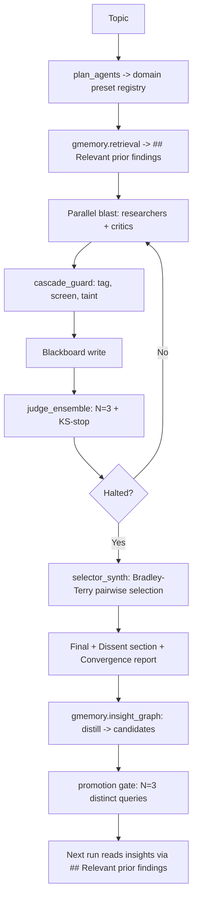

# Blitz-Swarm

**A parallel multi-agent architecture for consensus-driven research synthesis, with hierarchical memory, frontier-paper mechanisms, and a recursive self-improvement loop.**

[](#testing)
[](CHANGELOG.md)
[](LICENSE)

---

## Abstract

Blitz-Swarm is a multi-agent research system where agents execute simultaneously, share memory through a live blackboard, and iterate toward consensus through voting rounds. The default local backend is now Codex CLI through one typed invocation layer, with Claude and Gemini retained as explicit fallback adapters. Unlike sequential pipelines, Blitz-Swarm fires agents in parallel, filters tainted outputs before future context, and can halt when an N-judge ensemble's score distribution stabilizes. Dissenting views are explicitly preserved.

v0.2.1 adds Codex-first orchestration: `backends.py` owns `AgentCall`, `AgentResult`, and backend adapters; consensus mode, Mythos mode, planning, memory LLM helpers, judge hooks, and selector hooks now route through that layer.

Recursion is hard-capped at L3 — humans audit any change beyond the L2 allow-list.

---

## What ships in v0.2.1

| Layer | Module | Anchor | LOC | Tests |
|---|---|---|---|---|
| Bench | `bench/{slate_v1.toml, runner.py, detectors.py, mast_regression.py, stats.py}` | Cemri 2503.13657, Shen 2603.29632 | ~1900 | 75 |
| Mechanism | `mechanisms/cascade_guard.py` | Xie 2603.04474 | ~370 | 23 |
| Mechanism | `mechanisms/judge_ensemble.py` | Hu 2510.12697 + Autorubric 2603.00077 | ~340 | 23 |
| Mechanism | `mechanisms/selector_synth.py` | Maryanskyy 2603.20324 + Liu 2604.17139 | ~380 | 21 |
| Prompts | `prompts/{general, crypto}/*.md` + `prompts/loader.py` | MAR 2512.20845 | ~150 | 24 |
| Memory | `gmemory/{schema.sql, query_graph.py, insight_graph.py, promotion.py, retrieval.py, hybrid.py, meta.py}` | Zhang 2506.07398, GAM 2604.12285 | ~1100 | 31 |
| Evolve | `evolve/{aflow_search.py, meta_loop.py, gepa_adapter.py}` | Liu 2410.10762, GEPA 2507.19457 | ~700 | 22 |
| Heterogeneity | `heterogeneity/{cli_router.py, routing_table.toml}` | Maryanskyy 2603.20324 | ~280 | 6 |
| Backends | `backends.py` | Codex CLI + structured output validation | ~470 | 7 |
| Managed Agents | `managed_agents/adapter.py` | Anthropic May 7 2026 beta | ~180 | 13 |

**Total**: 260 passing tests, 14 conditional skips, scipy-optional, framework-free.

---

## Architecture (v0.2)



The recursion ladder runs orthogonally:

```
L0  base swarm (above)                                   per task
L1a GEPA evolves prompts vs bench                        nightly
L1b AFlow MCTS evolves swarm graph vs bench              nightly
L2  meta_loop reads meta:* insights, proposes patches    weekly
L3  human audit                                          on demand
```

---

## Quick start

### Install

```bash
git clone https://github.com/Joona-t/blitz-swarm.git
cd blitz-swarm
pip install -e '.[dev]'
```

Optional dependencies (graceful degradation when absent):

- `redis` — Redis-backed blackboard (otherwise in-memory)
- `lancedb`, `sentence-transformers` — vector retrieval (otherwise BM25-only)
- `scipy`, `matplotlib`, `jsonlines` — bench statistics + charts
- `gepa` — `pip install gepa-ai/gepa` to run `scripts/optimize_prompts.py`
- `anthropic` — only if you opt into the Managed Agents backend

Required by default: local `codex` CLI. Optional fallback backends: `claude` CLI or `gemini` CLI, enabled only when selected via CLI/config.

### Run

```bash
# Single research topic, default Codex backend, max-quality profile
python orchestrator.py "Explain SQLite WAL mode internals" --backend codex --no-redis

# Dry-run the planned swarm without invoking agents
python orchestrator.py "Compare arguments for and against UBI" --backend codex --dry-run --no-llm-plan

# Bench smoke run (5 prompts × ~$0.50 budget)
python -m bench.runner --filter-id s001 s003 s016 s022 s026 --budget 3.0

# MAST regression scoreboard (no API cost)
python -m bench.mast_regression --write
```

---

## Configuration

`blitz.toml` controls every v0.2 surface:

```toml
[swarm]
max_rounds = 4
default_model = "sonnet"
quality_profile = "max"      # max / balanced / cheap
domain = "general"           # or "crypto"; loads prompts/<domain>/
persona_critics = false      # MAR personas (factual/logical/counterfactual)

[backend]
default = "codex"
fallback = ""                # fail clearly unless fallback is explicit

[backend.codex]
model = "gpt-5.5"
reasoning_effort = "high"
sandbox = "read-only"
approval_policy = "never"
ephemeral = true

[guard]                      # cascade_guard
enabled = true
mode = "balanced"            # off / speed / balanced / strict

[judge_ensemble]
enabled = true               # max-quality default
n_judges = 3
ks_threshold = 0.05
ks_consecutive = 2
min_rounds = 2

[selector]
enabled = true               # max-quality default; replaces blended synthesizer
granularity = "section"
n_judges = 3

[memory]
top_k_retrieval = 2
query_link_threshold = 0.7
llm_ops_threshold = 10
gmemory_tier = 3             # G-Memory is canonical; memory/ remains compat

[evolve]
backend = "cli"              # or "managed_agents" (opt-in)
auto_merge_threshold = 0.4
regression_bound = 0.3
```

A v0.1.x config file runs unchanged on v0.2 — every new feature is gated.

---

## Methodology

The MAST regression scoreboard at `bench/mast_scoreboard.md` reports detector coverage of the 14 named failure modes from Cemri 2503.13657. **v0.1.1 baseline: 9/14 detected.** v0.2.1 wires cascade guard, judge ensemble, and selector synthesis into the main run loop; full n≥20 live benchmark results are still pending.

The bench runner `bench/runner.py` is `swarm_fn`-injectable so any future swarm topology can be scored without the orchestrator-integration coupling. Statistical analysis (`bench/stats.py`) uses paired t-test, Cohen's d_z, and bootstrap CI — scipy is optional and the module degrades to a normal-CDF approximation when scipy is missing.

A baseline run on v0.1.1 — costs API tokens and lands in `bench/runs/baseline_v0.1.1/` — remains pending. It should now compare against the Codex-first v0.2.1 stack rather than the earlier module-only v0.2.0 state.

---

## Honest limitations

- **No real bench run yet.** Mechanisms and backend plumbing have unit/integration tests with mocked LLM hooks; no n≥20 live Codex-vs-baseline slate has been executed.
- **Cascade guard LLM adjudication is still heuristic.** The guard is wired into orchestration and filters errored/raw/blocked outputs, but claim decomposition/screening still uses the LLM-free hooks unless replaced.
- **Empirical-CDF KS instead of parametric BB mixture in `judge_ensemble`.** Honest deviation from Hu 2510.12697 — at N=3-7 the empirical CDF gives the same halt signal without scipy or EM, but at higher N the parametric variant may be sharper.
- **GAM "promotion gate" is N=3-distinct-query, not LLM-discrimination.** GAM uses LLM-discrimination at session boundaries that don't exist in a sessionless swarm. The structural rule is documented in `gmemory/promotion.py` docstring — not a citation claim.
- **No NEO / iLTN / neuro-symbolic compositional reasoning.** No 2025-2026 paper at applicability ≥6 demonstrates this without fine-tuning. Deferred to v0.3+.
- **Codex telemetry is partial.** `AgentResult` standardizes cost/token fields, but Codex CLI does not currently expose cost in the same envelope shape as Claude CLI, so those fields are optional.
- **Recursion bound at L3.** No L4. The system does not rewrite its own safety thresholds.

---

## Repository structure

```
blitz-swarm/
├── orchestrator.py              # main entrypoint, run_swarm()
├── agents.py                    # plan_agents, BlitzAgent, persona registry
├── backends.py                  # AgentCall/AgentResult + codex/claude/gemini adapters
├── consensus.py                 # convergence voting, dissent extraction
├── blackboard.py                # Redis blackboard + in-memory fallback
├── embedder.py                  # MiniLM wrapper (loaded once at startup)
├── config.py                    # blitz.toml loader, dataclass-based
├── metrics.py                   # per-run metrics, JSONL log
├── memory/                      # compatibility facade over local G-Memory storage
├── prompts/
│   ├── loader.py                # PromptLoader + assign_personas (MAR)
│   ├── general/*.md             # default preset, paper-grounded prompts
│   └── crypto/*.md              # v0.1.x trading-research preset
├── mechanisms/
│   ├── cascade_guard.py         # genealogy graph + taint propagation
│   ├── judge_ensemble.py        # N-judge debate + KS-stop
│   └── selector_synth.py        # BT MLE + pairwise span selection
├── gmemory/                     # G-Memory Tier 2/3 + hybrid retrieval
├── evolve/                      # GEPA + AFlow + meta_loop (Phase 3)
├── heterogeneity/               # claude/codex/gemini routing
├── managed_agents/              # opt-in Anthropic Managed Agents adapter
├── bench/                       # 30-prompt slate + runner + detectors + stats
├── docs/
│   ├── BIBLIOGRAPHY.md          # all citations, paper-grounded mapping
│   ├── research/                # 4 implementation deep dives
│   ├── METHODOLOGY.md           # bench experiment design
│   ├── RESEARCH_LOG.md          # lab notebook
│   ├── ROADMAP.md               # post-v0.2 work
│   ├── CLAIMS_AND_EVIDENCE.md   # claim → evidence mapping
│   └── LIMITATIONS.md           # what we don't know
├── tests/                       # 260 passing, 14 skipped
├── BUGS_AND_ITERATIONS.md       # patch trail
├── research.md                  # source-of-truth research backbone
└── plan.md                      # phase-by-phase TDD plan
```

---

## Citation

```bibtex
@software{tyrninoksa2026blitzswarm_v02,
  author = {Tyrninoksa, Joona},
  title = {Blitz-Swarm v0.2.1: Codex-first multi-agent research swarm},
  year = {2026},
  url = {https://github.com/Joona-t/blitz-swarm},
  version = {0.2.1},
  license = {MIT}
}
```

This is an independent research artifact by a solo developer. Not affiliated with any institution. All citations in `docs/BIBLIOGRAPHY.md`.

---

## License

MIT. Build on it. Break it. Make it better. The recursion bound at L3 stays — humans audit anything beyond.
