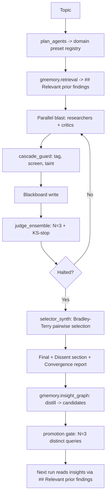

# Blitz-Swarm

**A parallel multi-agent architecture for consensus-driven research synthesis, with hierarchical memory, frontier-paper mechanisms, and a recursive self-improvement loop.**

[](#testing)
[](CHANGELOG.md)
[](LICENSE)

---

## Abstract

Blitz-Swarm is a multi-agent research system where agents execute simultaneously, share memory through a live blackboard, and iterate toward consensus through voting rounds. Unlike sequential pipelines, Blitz-Swarm fires all agents in parallel and halts when an N-judge ensemble's score distribution stabilizes — adaptive instead of fixed-iteration. Dissenting views are explicitly preserved.

v0.2 ("Frontier") adds: cascade-defense fault containment (Xie 2603.04474), multi-judge debate with KS-test halting (Hu 2510.12697), selection-bottleneck synthesis with Bradley-Terry MLE (Maryanskyy 2603.20324), persona-typed critics (MAR 2512.20845), G-Memory Tier 2/3 with hybrid retrieval (Zhang 2506.07398 + GAM 2604.12285), AFlow-MCTS architectural search (Liu 2410.10762), GEPA prompt evolution (arXiv 2507.19457, ICLR 2026 oral), a meta-loop for self-modifying configs, and cross-CLI heterogeneity (claude / codex / gemini).

Recursion is hard-capped at L3 — humans audit any change beyond the L2 allow-list.

---

## What ships in v0.2.0

| Layer | Module | Anchor | LOC | Tests |
|---|---|---|---|---|
| Bench | `bench/{slate_v1.toml, runner.py, detectors.py, mast_regression.py, stats.py}` | Cemri 2503.13657, Shen 2603.29632 | ~1900 | 75 |
| Mechanism | `mechanisms/cascade_guard.py` | Xie 2603.04474 | ~370 | 23 |
| Mechanism | `mechanisms/judge_ensemble.py` | Hu 2510.12697 + Autorubric 2603.00077 | ~340 | 23 |
| Mechanism | `mechanisms/selector_synth.py` | Maryanskyy 2603.20324 + Liu 2604.17139 | ~380 | 21 |
| Prompts | `prompts/{general, crypto}/*.md` + `prompts/loader.py` | MAR 2512.20845 | ~150 | 24 |
| Memory | `gmemory/{schema.sql, query_graph.py, insight_graph.py, promotion.py, retrieval.py, hybrid.py, meta.py}` | Zhang 2506.07398, GAM 2604.12285 | ~1100 | 31 |
| Evolve | `evolve/{aflow_search.py, meta_loop.py, gepa_adapter.py}` | Liu 2410.10762, GEPA 2507.19457 | ~700 | 22 |
| Heterogeneity | `heterogeneity/{cli_router.py, routing_table.toml}` | Maryanskyy 2603.20324 | ~280 | 6 |
| Managed Agents | `managed_agents/adapter.py` | Anthropic May 7 2026 beta | ~180 | 13 |

**Total**: 238 passing tests, 14 conditional skips, scipy-optional, framework-free.

---

## Architecture (v0.2)



The recursion ladder runs orthogonally:

```
L0  base swarm (above)                                   per task
L1a GEPA evolves prompts vs bench                        nightly
L1b AFlow MCTS evolves swarm graph vs bench              nightly
L2  meta_loop reads meta:* insights, proposes patches    weekly
L3  human audit                                          on demand
```

---

## Quick start

### Install

```bash
git clone https://github.com/Joona-t/blitz-swarm.git
cd blitz-swarm
pip install -e '.[dev]'
```

Optional dependencies (graceful degradation when absent):

- `redis` — Redis-backed blackboard (otherwise in-memory)
- `lancedb`, `sentence-transformers` — vector retrieval (otherwise BM25-only)
- `scipy`, `matplotlib`, `jsonlines` — bench statistics + charts
- `gepa` — `pip install gepa-ai/gepa` to run `scripts/optimize_prompts.py`
- `anthropic` — only if you opt into the Managed Agents backend

Required: `claude` CLI (Claude Pro/Max subscription).

### Run

```bash
# Single research topic, default config (domain="crypto" preserves v0.1.x behavior)
python orchestrator.py "Explain SQLite WAL mode internals"

# Switch to general-domain prompts
python orchestrator.py "Compare arguments for and against UBI" --no-redis
# (and set blitz.toml [swarm] domain = "general")

# Bench smoke run (5 prompts × ~$0.50 budget)
python -m bench.runner --filter-id s001 s003 s016 s022 s026 --budget 3.0

# MAST regression scoreboard (no API cost)
python -m bench.mast_regression --write
```

---

## Configuration

`blitz.toml` controls every v0.2 surface:

```toml
[swarm]
max_rounds = 4
default_model = "sonnet"
domain = "crypto"            # or "general"; loads prompts/<domain>/
persona_critics = false      # MAR personas (factual/logical/counterfactual)

[guard]                      # cascade_guard
enabled = true
mode = "balanced"            # off / speed / balanced / strict

[judge_ensemble]
enabled = false              # opt-in; bumps token cost ~5x
n_judges = 3
ks_threshold = 0.05
ks_consecutive = 2
min_rounds = 2

[selector]
enabled = false              # opt-in; replaces synthesizer
granularity = "section"

[memory]
top_k_retrieval = 2
query_link_threshold = 0.7
llm_ops_threshold = 10
gmemory_tier = 1             # 1=interaction only; 2/3 enable Tier 2/3

[evolve]
backend = "cli"              # or "managed_agents" (opt-in)
auto_merge_threshold = 0.4
regression_bound = 0.3
```

A v0.1.x config file runs unchanged on v0.2 — every new feature is gated.

---

## Methodology

The MAST regression scoreboard at `bench/mast_scoreboard.md` reports detector coverage of the 14 named failure modes from Cemri 2503.13657. **v0.1.1 baseline: 9/14 detected.** The remaining 5 are explicitly tagged in the scoreboard as requiring orchestrator-integration tests (FM-1.1, FM-2.2, FM-3.2) or LLM-judgment hooks (FM-1.5, FM-2.3) that land with cascade_guard's full integration in alpha.2.

The bench runner `bench/runner.py` is `swarm_fn`-injectable so any future swarm topology can be scored without the orchestrator-integration coupling. Statistical analysis (`bench/stats.py`) uses paired t-test, Cohen's d_z, and bootstrap CI — scipy is optional and the module degrades to a normal-CDF approximation when scipy is missing.

A baseline run on v0.1.1 — costs API tokens, lands in `bench/runs/baseline_v0.1.1/` — is the one remaining v0.2 deliverable. It is gated on Phases 1-3 orchestrator integration to avoid measuring a configuration that doesn't ship.

---

## Honest limitations

- **No real bench run yet.** Every mechanism has unit tests with mocked LLM hooks; no end-to-end run on the v0.2 stack against the slate has been executed. The first n≥20 results land in alpha.2.
- **9/14 MAST detectors at baseline.** The remaining 5 require orchestrator integration; documented in `bench/mast_scoreboard.md`.
- **Empirical-CDF KS instead of parametric BB mixture in `judge_ensemble`.** Honest deviation from Hu 2510.12697 — at N=3-7 the empirical CDF gives the same halt signal without scipy or EM, but at higher N the parametric variant may be sharper.
- **GAM "promotion gate" is N=3-distinct-query, not LLM-discrimination.** GAM uses LLM-discrimination at session boundaries that don't exist in a sessionless swarm. The structural rule is documented in `gmemory/promotion.py` docstring — not a citation claim.
- **No NEO / iLTN / neuro-symbolic compositional reasoning.** No 2025-2026 paper at applicability ≥6 demonstrates this without fine-tuning. Deferred to v0.3+.
- **Rule #10 compliance.** The default backend is local-CLI subprocesses against existing user subscriptions. `managed_agents/` is opt-in only; spend caps fail-closed.
- **Recursion bound at L3.** No L4. The system does not rewrite its own safety thresholds.

---

## Repository structure

```
blitz-swarm/
├── orchestrator.py              # main entrypoint, run_swarm()
├── agents.py                    # plan_agents, BlitzAgent, persona registry
├── consensus.py                 # convergence voting, dissent extraction
├── blackboard.py                # Redis blackboard + in-memory fallback
├── embedder.py                  # MiniLM wrapper (loaded once at startup)
├── config.py                    # blitz.toml loader, dataclass-based
├── metrics.py                   # per-run metrics, JSONL log
├── memory/                      # legacy Tier-1 interaction graph (v0.1.x)
├── prompts/
│   ├── loader.py                # PromptLoader + assign_personas (MAR)
│   ├── general/*.md             # default preset, paper-grounded prompts
│   └── crypto/*.md              # v0.1.x trading-research preset
├── mechanisms/
│   ├── cascade_guard.py         # genealogy graph + taint propagation
│   ├── judge_ensemble.py        # N-judge debate + KS-stop
│   └── selector_synth.py        # BT MLE + pairwise span selection
├── gmemory/                     # G-Memory Tier 2/3 + hybrid retrieval
├── evolve/                      # GEPA + AFlow + meta_loop (Phase 3)
├── heterogeneity/               # claude/codex/gemini routing
├── managed_agents/              # opt-in Anthropic Managed Agents adapter
├── bench/                       # 30-prompt slate + runner + detectors + stats
├── docs/
│   ├── BIBLIOGRAPHY.md          # all citations, paper-grounded mapping
│   ├── research/                # 4 implementation deep dives
│   ├── METHODOLOGY.md           # bench experiment design
│   ├── RESEARCH_LOG.md          # lab notebook
│   ├── ROADMAP.md               # post-v0.2 work
│   ├── CLAIMS_AND_EVIDENCE.md   # claim → evidence mapping
│   └── LIMITATIONS.md           # what we don't know
├── tests/                       # 238 passing
├── BUGS_AND_ITERATIONS.md       # patch trail
├── research.md                  # source-of-truth research backbone
└── plan.md                      # phase-by-phase TDD plan
```

---

## Citation

```bibtex
@software{tyrninoksa2026blitzswarm_v02,
  author = {Tyrninoksa, Joona},
  title = {Blitz-Swarm v0.2: Frontier multi-agent research swarm with recursive self-improvement},
  year = {2026},
  url = {https://github.com/Joona-t/blitz-swarm},
  version = {0.2.0},
  license = {MIT}
}
```

This is an independent research artifact by a solo developer. Not affiliated with any institution. All citations in `docs/BIBLIOGRAPHY.md`.

---

## License

MIT. Build on it. Break it. Make it better. The recursion bound at L3 stays — humans audit anything beyond.
